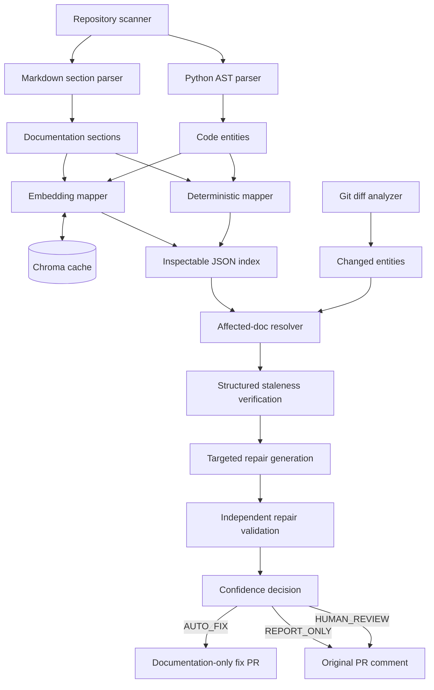
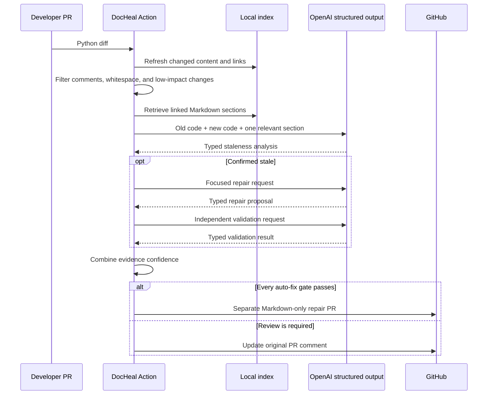

# DocHeal

> Keep your documentation synchronized with your code.

DocHeal is a GitHub-native documentation reliability tool. It watches Python changes in pull requests, identifies the small set of Markdown sections that may be affected, and asks an LLM to verify whether those sections are actually stale. A repair is created only after an independent validation pass and a centralized confidence decision. High-confidence repairs can be proposed in a separate documentation-only pull request; ambiguous findings stay on the original pull request for human review.

DocHeal is not a chatbot, a bulk documentation generator, or a dashboard. Its primary interface is the pull request.

## Why this exists

Technical documentation usually becomes wrong one claim at a time: a parameter becomes optional, a route changes, a configuration key disappears, or a return contract acquires a new condition. Reviewers can see the code diff, but locating every prose statement coupled to that code is expensive. Repository-wide generation is not a safe answer because it loses intentional prose and tends to invent behavior.

DocHeal treats synchronization as an evidence and change-detection problem:

- static analysis establishes what code entities exist;
- deterministic and semantic links establish where those entities are documented;
- the pull-request diff limits analysis to meaningful changes;
- structured LLM calls judge staleness and produce a narrow candidate repair;
- an independent structured validation call checks the candidate;
- a confidence policy determines whether automation is safe.

The conservative default is `auto_fix_enabled: false`.

## Architecture



The implementation keeps parsing, mapping, provider access, repair, validation, decisions, and GitHub side effects behind separate interfaces. Repository code is parsed but never imported or executed.

## End-to-end lifecycle



Every run updates a comment containing `<!-- docheal-report:v1 -->`, preventing repeated workflow runs from spamming the discussion.

## Repository layout

```text
docheal/
├── action.yml                   Reusable Docker Action contract
├── Dockerfile                   Python 3.12 Action image
├── config/default.yaml          Safe defaults
├── src/docheal/
│   ├── parser/                  Python AST and Markdown parsing
│   ├── mapping/                 Deterministic and semantic relationships
│   ├── embeddings/              OpenAI embeddings and Chroma cache
│   ├── diff/                    Unified diff and entity change analysis
│   ├── detection/               Candidate resolution and stale-doc checks
│   ├── repair/                  Proposal generation and safe patching
│   ├── validation/              Independent repair quality gate
│   ├── decision/                Central confidence policy
│   ├── github/                  Comments, branches, and pull requests
│   ├── models/                  Strict Pydantic contracts
│   ├── prompts/                 Versioned prompt templates
│   ├── cli/                     Local and Action entry points
│   └── pipeline.py              Dependency-injected orchestration
├── demo/                        Reproducible stale-signature scenario
└── tests/                       Unit and integration coverage
```

## Code parsing

The Python parser uses the standard-library AST and emits stable entity IDs such as `src/users.py::create_user` and `src/auth.py::AuthService.login`. IDs do not depend on line numbers. Functions, async functions, classes, methods, uppercase configuration constants, decorated API endpoints, and decorated CLI commands include source ranges, signatures, decorator metadata, parameters, and a content hash.

Because parsing never imports a module, repository initialization code and malicious source payloads cannot run inside DocHeal.

## Documentation parsing

Markdown is split at headings outside fenced code blocks. Each section preserves its heading hierarchy, exact source range, parent relationship, original text, content hash, and probable code references found in inline code or qualified identifiers. Repairs operate on these section boundaries rather than regenerating files.

## Code-to-documentation mapping

Mapping has two independent levels:

1. The deterministic mapper finds exact symbols, qualified names, routes, command names, signatures, and matching headings. This path remains available when all model APIs are unavailable.
2. The semantic mapper embeds compact entity and section representations, computes cosine similarity, and adds links above the configured threshold.

Relationships, entities, and sections are persisted in `.docheal/index.json`, which is ordinary inspectable JSON. Chroma data lives in `.docheal/chroma`. Stable IDs and content hashes allow the Chroma adapter to reuse unchanged embeddings and request only cache misses during an explicit semantic refresh.

## Diff analysis

DocHeal parses unified Git diffs, associates changed lines with stable AST entities, and compares old and new entities. AST-equivalent edits are ignored, so whitespace and comment-only changes do not consume LLM calls. Signature changes receive higher significance than internal implementation changes. Removed symbols can still be matched to current documentation, but they cannot be auto-repaired because there is no new code contract to validate against.

## Staleness detection

Only ranked candidate sections are sent to the model. Each request contains the old entity, new entity, one documentation section, and concise change metadata. The response must validate against `StalenessAnalysis`; malformed output fails closed. Evidence, affected claims, severity, confidence, and the recommended action are required.

All repository content is wrapped in explicit `UNTRUSTED_*` delimiters. System prompts state that source and documentation are data, not instructions. Text such as “ignore previous instructions” inside a README has no operational authority.

## Repair generation and patching

A repair request contains the current section, the new code, and a validated diagnosis. Its typed response must preserve the target file, section ID, and exact original content. The patcher then verifies that:

- the resolved path remains inside the repository;
- the target is Markdown;
- the original section exists exactly once;
- only that section is replaced;
- line endings are preserved;
- the result remains structurally parseable Markdown.

Source-code paths are never writable through the repair interface.

## Independent repair validation

Generation is not approval. A second model pass assesses correctness, preservation of previously accurate content, unsupported claims, focus, and style consistency. Unsupported claims or an invalid result force human review regardless of the generator's confidence.

## Confidence decisions

The default combined confidence is a weighted score:

| Evidence | Weight |
|---|---:|
| deterministic/semantic mapping | 0.15 |
| staleness verification | 0.30 |
| repair generation | 0.20 |
| independent validation | 0.35 |

`AUTO_FIX` requires a confirmed stale section, a proposal, a passing validation with no unsupported claims, auto-fix enabled, and a score at or above `0.90`. Scores from `0.70` through the auto-fix boundary become `HUMAN_REVIEW`. Lower-confidence evidence is `REPORT_ONLY`. Thresholds live in configuration rather than being scattered through the pipeline.

## GitHub Action

A consumer repository checks out complete history and invokes DocHeal on pull-request events:

```yaml
name: Documentation integrity

on:
  pull_request:
    types: [opened, synchronize, reopened]

permissions:
  contents: write
  pull-requests: write

jobs:
  docheal:
    runs-on: ubuntu-latest
    steps:
      - uses: actions/checkout@v4
        with:
          fetch-depth: 0
      - uses: byanjanstarlord-arch/Docheal@v1
        with:
          openai_api_key: ${{ secrets.OPENAI_API_KEY }}
          github_token: ${{ github.token }}
          source_directories: src
          documentation_paths: docs,README.md
          auto_fix_enabled: "false"
```

`pull-requests: write` is required to create or update the report comment. `contents: write` is required only when `auto_fix_enabled` is true because a repair branch must be created. With auto-fix disabled, reduce `contents` to `read`.

Action outputs are `sections_checked`, `stale_sections`, `repairs_generated`, `repairs_validated`, `human_review_items`, and `created_pr_url`.

### Automatic fix PR behavior

An automatic fix starts from the original feature branch, never GitHub's base branch and never the working branch in place. The new branch contains Markdown updates only and targets the feature branch, keeping documentation and code reviewable together before the original PR merges. If any branch, content, or API operation fails, DocHeal attempts to remove the temporary branch and reports an actionable failure.

Fork-originated pull requests are always routed to human review: the base repository cannot safely create a sibling branch against a contributor's fork branch.

### Human-review behavior

Missing repairs, malformed model output, failed validation, removed APIs, ambiguous behavior, confidence below the automatic threshold, disabled auto-fix, and fork constraints all prevent automatic changes. The original PR comment names the file and section, explains the evidence, and shows the confidence and decision.

## Configuration

`config/default.yaml` is the reference configuration:

```yaml
source:
  include: [src]
  exclude: [tests, .venv, venv]
  language: python
documentation:
  include: [docs, README.md]
embeddings:
  model: text-embedding-3-small
  similarity_threshold: 0.80
  collection: docheal
llm:
  model: gpt-4.1-mini
  temperature: 0
  timeout_seconds: 60
decision:
  auto_fix_threshold: 0.90
  human_review_threshold: 0.70
github:
  auto_fix_enabled: false
  branch_prefix: docheal/fix
index:
  path: .docheal/index.json
  chroma_path: .docheal/chroma
```

Action inputs override the corresponding file values. The local loader also recognizes:

| Environment variable | Purpose |
|---|---|
| `OPENAI_API_KEY` | OpenAI authentication; never logged |
| `DOCHEAL_LLM_MODEL` | Structured-analysis model override |
| `DOCHEAL_EMBEDDING_MODEL` | Embedding model override |
| `DOCHEAL_AUTO_FIX_THRESHOLD` | Automatic repair threshold |
| `DOCHEAL_AUTO_FIX_ENABLED` | Local auto-fix policy |
| `GITHUB_TOKEN` | GitHub API authentication for Action mode |

## Local development

DocHeal requires Python 3.11 or newer. An editable development environment can be created with:

```bash
python -m venv .venv
source .venv/bin/activate
python -m pip install -e ".[dev]"
```

Windows PowerShell uses `.venv\Scripts\Activate.ps1` for activation.

The CLI separates deterministic inspection from API-backed verification:

```bash
docheal scan --repo . --config config/default.yaml
docheal index --repo . --config config/default.yaml
docheal index --repo . --config config/default.yaml --semantic
docheal analyze --repo . --base origin/main --head HEAD
docheal verify --repo . --base origin/main --head HEAD
docheal repair --repo . --base origin/main --head HEAD
docheal repair --repo . --base origin/main --head HEAD --apply
```

`scan`, deterministic `index`, and `analyze` need no API key. `verify` and `repair` require `OPENAI_API_KEY`. `repair` is proposal-only unless `--apply` is explicitly supplied; even then only `AUTO_FIX` decisions can reach the Markdown patcher.

## Demo

The fixture changes:

```python
create_user(name, email)
```

to:

```python
create_user(name, email, role="user")
```

while `docs/users.md` retains the old signature. The demo uses a deterministic, test-only provider implementing the same structured provider protocol, so it is reproducible without credentials and does not hardcode results into production analysis:

```bash
python -m docheal demo
```

A successful run reports one changed entity, one checked section, confirmed staleness, a validated repair, and `AUTO_FIX`. Add `--apply` only when intentionally updating the fixture.

## Example pull-request walkthrough

Suppose PR #41 adds `role="user"` to `create_user`. DocHeal identifies `src/users.py::create_user`, retrieves the `create_user` section in `docs/users.md`, and asks whether the old two-argument signature is inaccurate. If verification returns 96%, the focused repair returns 97%, validation returns 96%, and the deterministic link is 100%, the combined score exceeds the 90% auto-fix threshold. DocHeal creates a branch such as `docheal/fix/pr-41-123456`, opens a documentation PR targeting the feature branch, and updates its stable report comment on PR #41 with the repair link.

If the behavior change is complex or validation identifies an unsupported claim, no branch is created. The report requests review and preserves the evidence.

## Security model

- API keys and authorization headers are neither persisted nor logged.
- Source and docs are untrusted inputs separated from system instructions.
- Model outputs are parsed into strict Pydantic models with extra fields forbidden.
- No model output is interpreted as a shell command or executable code.
- Repository source is parsed statically and never imported.
- Paths are resolved and checked against the repository root.
- Automatic writes accept only `.md` and `.markdown` targets.
- Original content is compared immediately before applying a patch.
- GitHub permissions are explicit and can be reduced when auto-fix is off.
- Failures in embeddings preserve deterministic analysis; failures in verification or validation prevent auto-fix.

## Testing

The normal suite is entirely offline and mocks the model boundary:

```bash
pytest
python -m docheal demo
python -m compileall -q src
```

Coverage includes parser locations and IDs, Markdown hierarchy, both mapper interfaces, diff parsing, comment-only filtering, affected-section resolution, strict models, configuration, confidence policies, safe patching, and the complete demo pipeline. Real API and live GitHub tests are intentionally separate from the default suite.

The Action image can be built and its CLI exercised with:

```bash
docker build -t docheal:local .
docker run --rm docheal:local demo
```

## Operational behavior and cost control

Deterministic filtering precedes every LLM request. DocHeal sends one changed entity and one ranked section rather than a repository dump. The JSON index avoids rescanning during repeated local commands, while the Chroma content-hash cache avoids re-embedding unchanged items on semantic refresh. Embedding failure does not erase deterministic links. Structured logging excludes field names containing `token` or `key`; GitHub output contains counts and URLs, not credentials.

## Limitations

- V1 parses Python source and Markdown documentation only.
- Python behavior changes that are not visible in the AST diff still require model judgment.
- Markdown parsing is heading-oriented rather than a complete CommonMark syntax tree.
- Semantic indexing needs OpenAI and Chroma runtime dependencies.
- Live OpenAI and GitHub operations require credentials and are not part of offline tests.
- Automatic fix PRs are disabled for fork-originated pull requests.
- A provider outage produces review/report output rather than an automatic change.
- The Action needs full Git history (`fetch-depth: 0`) to compare base and head reliably.

## Roadmap

V2 candidates include tree-sitter language adapters, richer Markdown syntax preservation, durable CI cache examples, GitHub App authentication, token-usage telemetry, batched structured verification, cross-repository documentation links, SARIF output, and policy profiles for regulated repositories. New providers should implement the existing LLM or embedding protocol rather than changing pipeline logic.

## License

Apache-2.0. See `LICENSE`.
